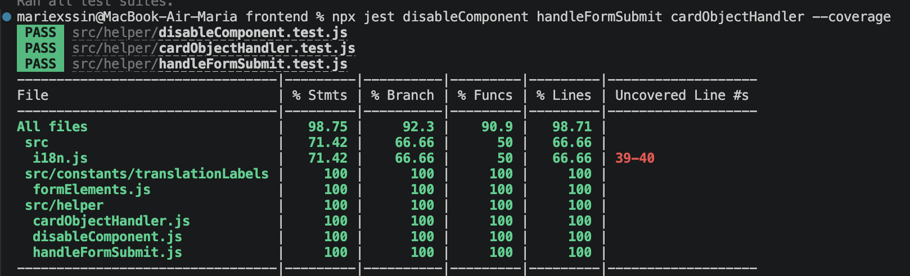

# Coverage Report

## Загальне покриття
- Statements/Instructions: 30.06% 
- Branches: 9.16%
- Functions/Methods: 8.47%
- Lines: 32.02%

## Аналіз
- **Які функції/класи покриті найкраще?**
Завдяки розширенню тестових наборів, цільові файли в папці `src/helper` (`disableComponent.js`, `handleFormSubmit.js`, `cardObjectHandler.js`) досягли 100% покриття. Додано тести Edge Cases (0, null, undefined), жорстку перевірку типів (`.toStrictEqual`) та Negative Testing на відловлювання `TypeError` при передачі порожніх об'єктів.

- **Які потребують додаткових тестів?**
Аналіз глобального покриття показує, що додаткових тестів найбільше потребують модулі валідації (наприклад, `storeValidation.js` — 12.9%, `validateFields.js` — 44.26%). Глобальний показник проєкту (~30%) зумовлений саме відсутністю тестів у цих модулях. Вони потребують впровадження аналогічного підходу (перевірка `falsy` значень).

- **Чому деякі branches не покриті?**
Початково гілки логіки для відсутніх або некоректних даних (`null`, `undefined`, `0`) залишалися непротестованими, оскільки поточні тести в проєкті покривають переважно лише ідеальні сценарії ("happy paths") та ігнорують обробку помилок. Наразі для досліджуваних цільових файлів цю проблему повністю усунуто.

## Скріншот
