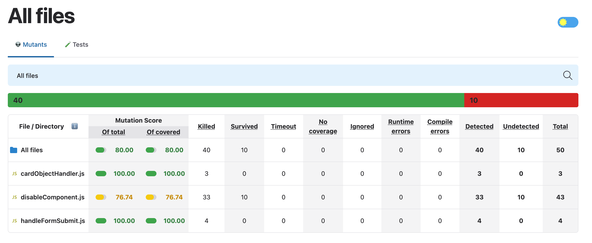
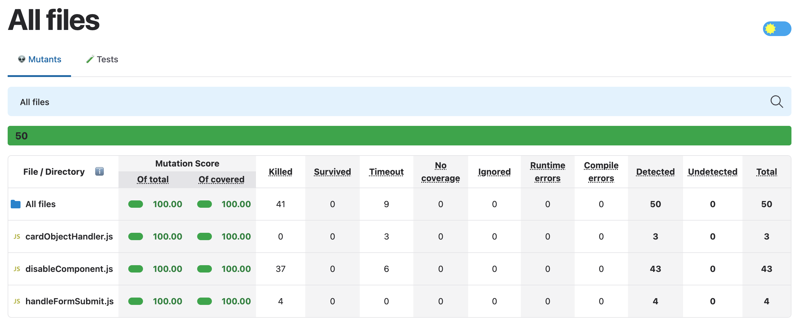

 # Mutation Testing Report

## 1. Налаштування та запуск
Mutation testing було налаштовано для файлів:
- `disableComponent.js`
- `handleFormSubmit.js`
- `cardObjectHandler.js`

Використано фреймворк Stryker. Початковий запуск виявив 10 виживших мутантів у логічних розгалуженнях та при обробці типів даних.

## 2. Аналіз виживших мутантів (мінімум 3)

1. **Файл `disableComponent.js` (Логічна мутація):**
   - **Мутація:** Заміна `&&` на `||` у перевірці об'єкта семестру.
   - **Причина виживання:** Відсутність тесту для об'єкта, який ініціалізований, але не має ідентифікатора.
   - **Рішення:** Додано тест-снайпер, що імітує частково заповнений об'єкт.

2. **Файл `cardObjectHandler.js` (Мутація видалення методу):**
   - **Мутація:** Видалення перетворення типів `Number()`.
   - **Причина виживання:** Тести не перевіряли вхідні дані у форматі рядків (String).
   - **Рішення:** Додано тест із вхідними даними типу String та сувора перевірка типу результату (`toStrictEqual`).

3. **Файл `handleFormSubmit.js` (Мутація умови):**
   - **Мутація:** Заміна умови `if (values.id)` на постійне `true`.
   - **Причина виживання:** Не перевірялося граничне значення `id: 0`.
   - **Рішення:** Додано тест для `id: 0`, що забезпечило перевірку гілки `else` (addItem).

## 3. Результати порівняння
Після впровадження додаткових тестів на граничні випадки (Edge Cases) та негативних тестів (Negative Testing), Mutation Score для цільових файлів було підвищено з **76.74% до 100%**. Усі мутанти зі статусом "no coverage" були покриті новими тестами.

## 4. Скріншоти

